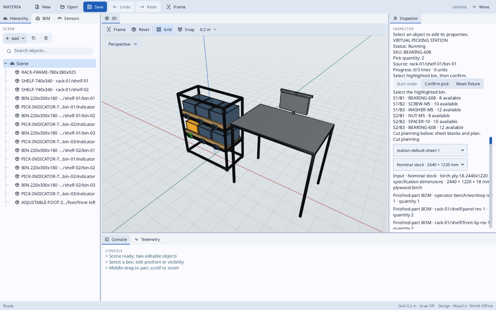
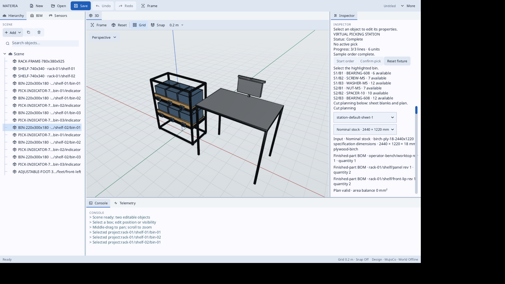

# Virtual picking station

The default station has one extrusion rack, two shelves, three addressed bins per shelf, six pick indicators, four adjustable feet, and an adjacent operator bench. The editor shows an order with one SKU per bin. Contents are scenario data; clicks represent scans and confirmations.

## Open and use

From the repository root:

```sh
./haxeon/scripts/haxeon build --project=machinekit/examples/picking-station/haxeon.json
./haxeon/scripts/haxeon build --project=app/haxeon.json
./app/run-built.sh --project=./machinekit/examples/picking-station/materia.project.json
```

In the editor, inspect the assembly hierarchy and open **Cut planning** for the sheet requirements and the validated default layout. In the picking panel, press **Start order**, click the highlighted source bin, then press **Confirm pick**. The source quantity and progress update after each confirmation. Selecting another bin reports an error and leaves inventory untouched. **Reset fixture** restores the starting stock and order. A red indicator denotes a shortage. The modeled bench monitor is geometry; the controls live in the editor panel.

For an active-pick capture, launch with `--project-action=start-order --capture-dir=machinekit/examples/picking-station/capture --frames=3` after building the app.

The project declares its editor extension in `materia.project.json`. `PickingStationUiExtension.hx` owns the panel contents, actions, selection response, and indicator colours. The `pickingstation` package under `src/` owns station geometry and the sample order state; it depends on MachineKit for component primitives and ManufacturingKit for sheet stock. The editor renders the project UI protocol described in [the app documentation](../../../app/docs/project-ui-extension.md).





## Checks and manufacturing outputs

The example commands use the compiled workflow artifact. The launcher's runtime library path needs the CAD and app libraries when running this standalone module:

```sh
export LD_LIBRARY_PATH="$PWD/haxeon/out:$PWD/app/build/host/native/app:$PWD/cadkit/build/debug/core${LD_LIBRARY_PATH:+:$LD_LIBRARY_PATH}"
./haxeon/.tools/hashlink/hl machinekit/examples/picking-station/build/host/main.hl check
./haxeon/.tools/hashlink/hl machinekit/examples/picking-station/build/host/main.hl station-check
./haxeon/.tools/hashlink/hl machinekit/examples/picking-station/build/host/main.hl scenario-demo
./haxeon/.tools/hashlink/hl machinekit/examples/picking-station/build/host/main.hl bom
./haxeon/.tools/hashlink/hl machinekit/examples/picking-station/build/host/main.hl cut-list
./haxeon/.tools/hashlink/hl machinekit/examples/picking-station/build/host/main.hl preview machinekit/examples/picking-station/materia.project.json.sheet.json sheet-001 station-default-sheet-1
```

`check` covers layout and IDs, BOM and sheet requirements, plan staleness, the full order, wrong bin, shortage, reset, repeated confirmation, and deterministic replay. `station-check` generates and checks the selectable assembly artifact. `bom` prints finished part counts, `cut-list` prints each extrusion member's cut length, and `preview` validates the authored guillotine cut plan. The project sheet record includes one registered stock sheet. A changed station dimension updates requirements; the original plan then reports stale references and must be revalidated or revised.

## Parameters and geometry

`PickingStationConfig` exposes bin width, depth, height, and wall thickness; bins per shelf; shelf count and spacing; rack depth; bench width, depth, and height; and optional shelf inclination. Rack width, shelf dimensions, position frames, and stock requirements are derived. Invalid bin clearances, rack depth, and shelf spacing are rejected. The authored sheet plan fits only the default panel dimensions and two shelves.

Bins are open-top shells. Pick indicators have simplified light, display, and confirmation geometry without electronics. The bench screen is a simple solid. Shelf supports, retaining lip, and feet are simplified. Extrusions use MachineKit's HFS5-2020 profile and `FrameAssembly`. The flat shelf and separate retaining lip fit ManufacturingKit's rectangular blank workflow. The BOM uses MachineKit's ISO 4762 M5 screws, with their placement omitted from the assembly geometry. Loose inventory items, human motion, hardware signals, and automatic nesting are not modeled.
